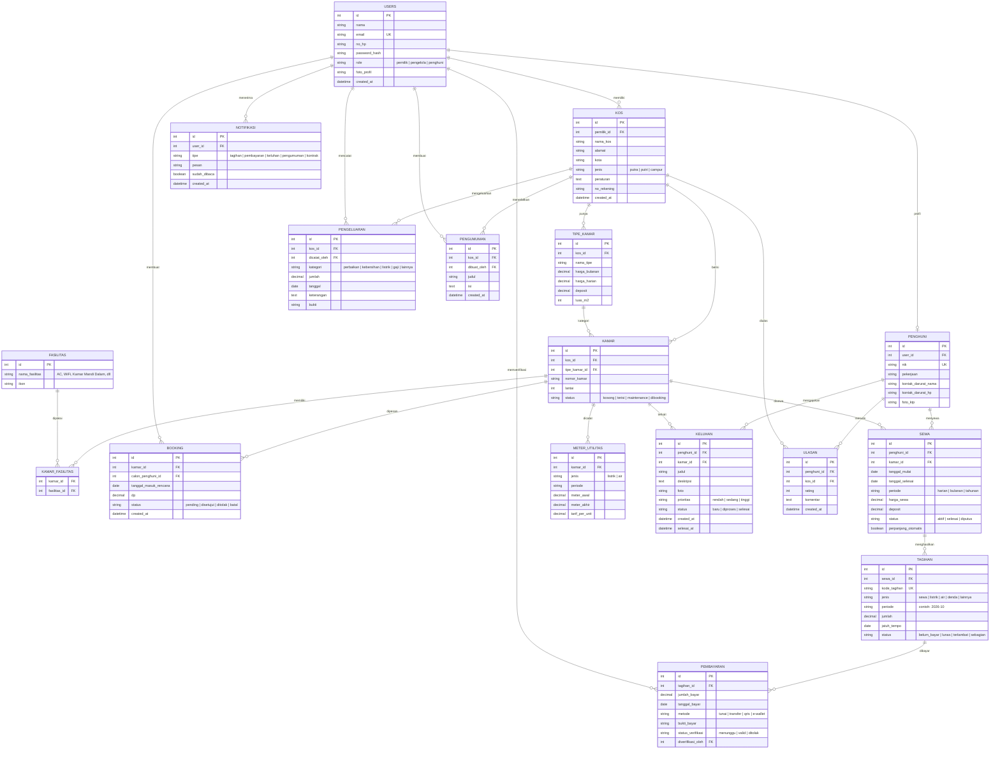

```mermaid
erDiagram
    USERS {
        int id PK
        string nama
        string email UK
        string no_hp
        string password_hash
        string role "pemilik | pengelola | penghuni"
        string foto_profil
        datetime created_at
    }

    KOS {
        int id PK
        int pemilik_id FK
        string nama_kos
        string alamat
        string kota
        string jenis "putra | putri | campur"
        text peraturan
        string no_rekening
        datetime created_at
    }

    TIPE_KAMAR {
        int id PK
        int kos_id FK
        string nama_tipe
        decimal harga_bulanan
        decimal harga_harian
        decimal deposit
        int luas_m2
    }

    KAMAR {
        int id PK
        int kos_id FK
        int tipe_kamar_id FK
        string nomor_kamar
        int lantai
        string status "kosong | terisi | maintenance | dibooking"
    }

    FASILITAS {
        int id PK
        string nama_fasilitas "AC, WiFi, Kamar Mandi Dalam, dll"
        string ikon
    }

    KAMAR_FASILITAS {
        int kamar_id FK
        int fasilitas_id FK
    }

    BOOKING {
        int id PK
        int kamar_id FK
        int calon_penghuni_id FK
        date tanggal_masuk_rencana
        decimal dp
        string status "pending | disetujui | ditolak | batal"
        datetime created_at
    }

    PENGHUNI {
        int id PK
        int user_id FK
        string nik UK
        string pekerjaan
        string kontak_darurat_nama
        string kontak_darurat_hp
        string foto_ktp
    }

    SEWA {
        int id PK
        int penghuni_id FK
        int kamar_id FK
        date tanggal_mulai
        date tanggal_selesai
        string periode "harian | bulanan | tahunan"
        decimal harga_sewa
        decimal deposit
        string status "aktif | selesai | diputus"
        boolean perpanjang_otomatis
    }

    TAGIHAN {
        int id PK
        int sewa_id FK
        string kode_tagihan UK
        string jenis "sewa | listrik | air | denda | lainnya"
        string periode "contoh: 2026-10"
        decimal jumlah
        date jatuh_tempo
        string status "belum_bayar | lunas | terlambat | sebagian"
    }

    PEMBAYARAN {
        int id PK
        int tagihan_id FK
        decimal jumlah_bayar
        date tanggal_bayar
        string metode "tunai | transfer | qris | e-wallet"
        string bukti_bayar
        string status_verifikasi "menunggu | valid | ditolak"
        int diverifikasi_oleh FK
    }

    METER_UTILITAS {
        int id PK
        int kamar_id FK
        string jenis "listrik | air"
        string periode
        decimal meter_awal
        decimal meter_akhir
        decimal tarif_per_unit
    }

    PENGELUARAN {
        int id PK
        int kos_id FK
        int dicatat_oleh FK
        string kategori "perbaikan | kebersihan | listrik | gaji | lainnya"
        decimal jumlah
        date tanggal
        text keterangan
        string bukti
    }

    KELUHAN {
        int id PK
        int penghuni_id FK
        int kamar_id FK
        string judul
        text deskripsi
        string foto
        string prioritas "rendah | sedang | tinggi"
        string status "baru | diproses | selesai"
        datetime created_at
        datetime selesai_at
    }

    PENGUMUMAN {
        int id PK
        int kos_id FK
        int dibuat_oleh FK
        string judul
        text isi
        datetime created_at
    }

    NOTIFIKASI {
        int id PK
        int user_id FK
        string tipe "tagihan | pembayaran | keluhan | pengumuman | kontrak"
        string pesan
        boolean sudah_dibaca
        datetime created_at
    }

    ULASAN {
        int id PK
        int penghuni_id FK
        int kos_id FK
        int rating
        text komentar
        datetime created_at
    }

    USERS ||--o{ KOS : "memiliki"
    KOS ||--o{ TIPE_KAMAR : "punya"
    KOS ||--o{ KAMAR : "berisi"
    TIPE_KAMAR ||--o{ KAMAR : "kategori"
    KAMAR ||--o{ KAMAR_FASILITAS : "memiliki"
    FASILITAS ||--o{ KAMAR_FASILITAS : "dipakai"
    KAMAR ||--o{ BOOKING : "dipesan"
    USERS ||--o{ BOOKING : "membuat"
    USERS ||--o| PENGHUNI : "profil"
    PENGHUNI ||--o{ SEWA : "menyewa"
    KAMAR ||--o{ SEWA : "disewa"
    SEWA ||--o{ TAGIHAN : "menghasilkan"
    TAGIHAN ||--o{ PEMBAYARAN : "dibayar"
    USERS ||--o{ PEMBAYARAN : "memverifikasi"
    KAMAR ||--o{ METER_UTILITAS : "dicatat"
    KOS ||--o{ PENGELUARAN : "mengeluarkan"
    USERS ||--o{ PENGELUARAN : "mencatat"
    PENGHUNI ||--o{ KELUHAN : "mengajukan"
    KAMAR ||--o{ KELUHAN : "terkait"
    KOS ||--o{ PENGUMUMAN : "menerbitkan"
    USERS ||--o{ PENGUMUMAN : "membuat"
    USERS ||--o{ NOTIFIKASI : "menerima"
    PENGHUNI ||--o{ ULASAN : "menulis"
    KOS ||--o{ ULASAN : "diulas"
```